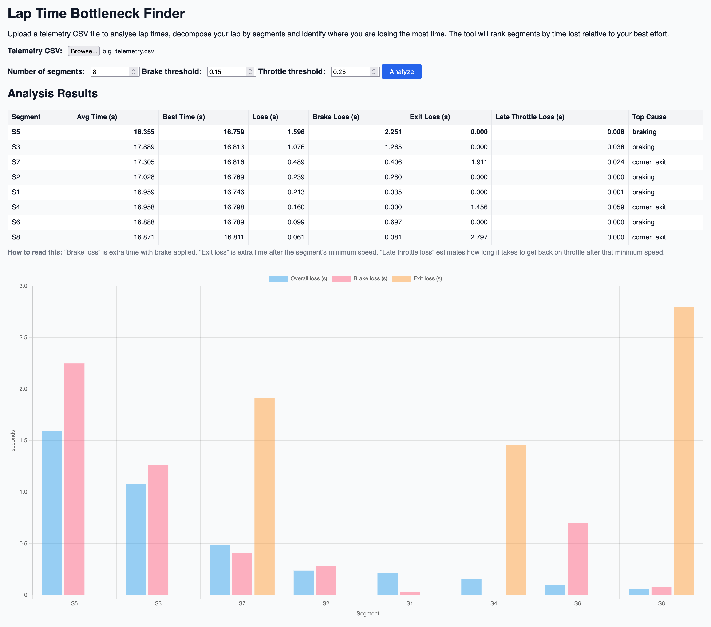

# Lap Time Bottleneck Demo

This project ingests vehicle telemetry, breaks a lap into equal‑length segments, computes
per‑segment timing statistics and identifies where the driver is losing
the most time.  It ships with a simple Flask API and a lightweight
web frontend for interactive exploration.

## Features

- 📥 **CSV ingestion** – drop in a telemetry file with
  `timestamp`, `lap`, `speed`, `throttle`, `brake`, `steering` and
  `track_position` columns.
- 🧠 **Analysis pipeline** – sorts data per lap, computes time
  differences, segments laps and calculates average vs. best segment
  times.
- 📊 **Performance metrics** – reports average speed, throttle and
  brake usage per segment alongside timing loss and loss percentage.
- 🔎 **Ranking** – segments are ranked by time lost relative to the
  best performance so you immediately know where the biggest gains lie.
- 🌐 **API + UI** – includes a Flask endpoint for programmatic access
  and a clean HTML/JS frontend with a table and bar chart powered by
  Chart.js.

## Project Structure

```text
lap-time-bottleneck-demo/
├── backend/
│   ├── analyzer.py        # analysis functions (segmentation, timing, metrics)
│   ├── app.py            # Flask API exposing `/analyze` endpoint
│   └── requirements.txt  # Python dependencies
├── frontend/
│   ├── index.html        # static webpage for uploading telemetry
│   └── script.js         # frontend logic (fetch + rendering)
├── data/
│   └── sample.csv        # generated sample telemetry for testing
└── README.md             # this documentation
```

## Getting Started

Setup and run instructions are located in:

➡️ **[SETUP.md](SETUP.md)**

## How It Works

1. **Segmenting the lap** – track positions are normalised from
   `0.0` (start/finish) to `1.0` and divided into `n` equal segments.
2. **Timing differences** – data is sorted per lap, then the
   difference between consecutive timestamps within each lap is
   computed.  Negative or zero deltas are discarded.  Optionally a
   `max_dt` threshold drops large gaps (e.g. telemetry dropouts).
3. **Aggregation** – total time spent in each segment is calculated
   per lap, then averaged across all laps.  The best (minimum) time
   per segment is found and subtracted from the average to produce
   `loss` and `loss_percent` metrics.
4. **Additional metrics** – average speed, throttle and brake usage are
   computed per segment to help explain why a bottleneck might exist.

The result is a table and bar chart ranking segments by time lost.
Segments with high loss values are your biggest improvement areas.


## Demo Screenshot




## Interpreting the Loss Metrics

The reported loss values are **heuristic indicators**, not a full physical decomposition of lap time. They are designed to highlight *where to look first*, not to perfectly partition total lap time.

- **Brake Loss** – Extra time spent with the brake applied compared to your best lap in that segment. High values typically indicate braking earlier, longer, or more aggressively than necessary.

- **Exit Loss** – Extra time spent in the powered-exit phase (after throttle is re-applied) compared to your best lap. High values often point to poor exit speed, traction limitations, or weak acceleration.

- **Late Throttle Loss** – Extra time between the segment’s minimum speed (apex proxy) and when throttle is re-applied. High values suggest hesitation or delayed throttle pickup after the corner.

Because these metrics overlap in time and represent different behavioral signals, they **do not sum to the total Loss**. The *Top Cause* simply reflects which signal deviates the most from your best lap in that segment.
